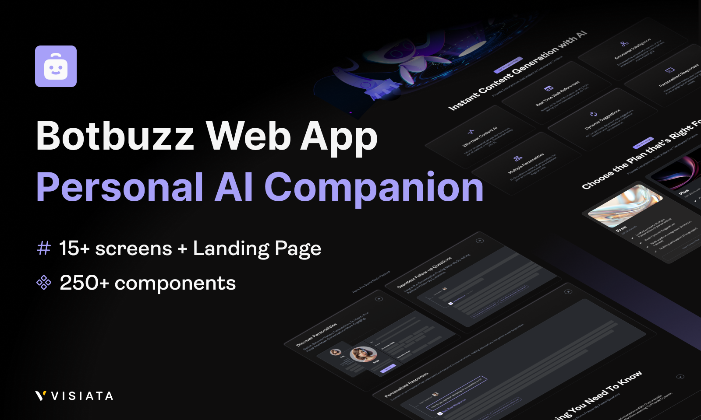

<div align="center">
  
  
  
  # BotBuzz
  
  
  
  
  
  
  
  <p>complete ai chat app <br/> developed by Mahdi Fayyazi Moghaddam</p>
  
  
  
</div>

---

## ✨ Features

- 🚀 **Fast & Responsive** - Optimized for all devices with responsive design
- 🎨 **Modern UI** - Built with Tailwind CSS for beautiful, customizable components
- 🔒 **Type Safe** - Full TypeScript support with strict type checking
- 📱 **Mobile First** - Designed for mobile devices first, then scales up
- 🎯 **Performance Focused** - Optimized for Core Web Vitals and fast loading
- 🔧 **Easy to Customize** - Modular components with clear documentation

## 🛠️ Tech Stack

| Technology       | Purpose                        |
| ---------------- | ------------------------------ |
| **Next.js**      | React framework for production |
| **TypeScript**   | Type safety and better DX      |
| **Tailwind CSS** | Utility-first styling          |
| **React**        | UI components                  |
| **ESLint**       | Code linting                   |

## 📦 Installation

### Prerequisites

- Node.js 18+
- npm / yarn / pnpm / bun

### Step 1: Clone the repository

```bash
git clone https://github.com/MahdiFayyaziMoghaddam/botbuzz.git
cd botbuzz
```

### Step 2: Install dependencies

```bash
npm install
# or
yarn install
# or
pnpm install
# or
bun install
```

### Step 3: Set up environment variables

```bash
cp .env.example .env.local
```

Then fill in your environment variables.

### Step 4: Run development server

```bash
npm run dev
# or
yarn dev
# or
pnpm dev
# or
bun dev
```

Open [http://localhost:3000](http://localhost:3000/) to see your app.

## 🚀 Usage

### Development

```bash
npm run dev     # Start dev server with hot reload
npm run build   # Create production build
npm run start   # Start production server
npm run lint    # Run ESLint
```

### Building for production

```bash
npm run build
npm run start
```

## 📱 Responsive Design

This project uses Tailwind's responsive prefixes for all breakpoints:

| Breakpoint  | Screen width | Prefix    |
| ----------- | ------------ | --------- |
| Default     | > 1280px     | -         |
| Extra Large | ≤ 1280px     | `max-xl:` |
| Large       | ≤ 1024px     | `max-lg:` |
| Medium      | ≤ 768px      | `max-md:` |
| Small       | ≤ 480px      | `max-sm:` |
| Extra Small | ≤ 350px      | `max-xs:` |

All components automatically adjust:

- 📏 Padding and margins scale down
- 🔤 Font sizes decrease proportionally
- 🖼️ Images and icons resize
- 📐 Layout shifts to single column on mobile

## 🤝 Contributing

Contributions are welcome! Please follow these steps:

1. Fork the repository
2. Create your feature branch (`git checkout -b feature/AmazingFeature`)
3. Commit your changes (`git commit -m 'Add some AmazingFeature'`)
4. Push to the branch (`git push origin feature/AmazingFeature`)
5. Open a Pull Request

### Development Guidelines

- Follow the existing code style
- Add tests for new features
- Update documentation as needed
- Ensure all CI checks pass

## 📧 Contact

Mahdi Fayyazi Moghaddam - [@mhdifyyzi](https://t.me/mhdifyyzi) - mfm.8768h@gmail.com

Project Link: [https://github.com/MahdiFayyaziMoghaddam/botbuzz](https://github.com/MahdiFayyaziMoghaddam/botbuzz)

## 🙏 Acknowledgments

- [Next.js Documentation](https://nextjs.org/docs)
- [Tailwind CSS](https://tailwindcss.com/)
- [Figma Design](https://www.figma.com/community/file/1392823164800309153)
- [Vercel](https://vercel.com/) for hosting
- All contributors and supporters
